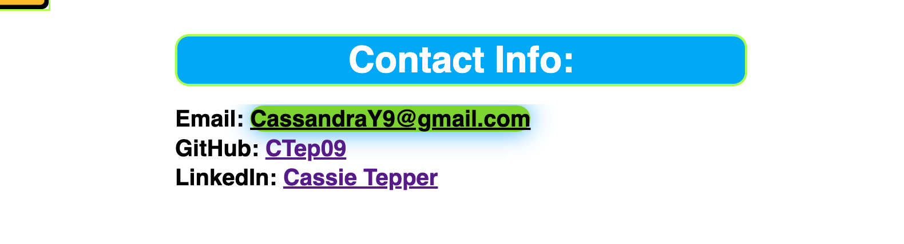

# Cassie-Tepper-Portfolio

## Description 

This portfolio is a place where I can showcase my work and track my growth as a developer. In the portfolio there is a section about me, where you can learn about my background and experience. Contact information is located at the bottom of the page. This portfolio was created using HTML, CSS and the magical gift that is Google. 

[Visit Portfolio Here](https://ctep09.github.io/Cassie-Tepper-Portfolio/)

## Usage 
The portfolio site  has a functional navigationbar that takes you to anywhere you choose. 

Here the links will give you options to Email me directly, oview more work and my process through my GitHub, or connect with my on LinkedIn!

## Credits
Under Construction photo courtesy of FreePNGLogos.com:
 https://www.freepnglogos.com/pics/under-construction 

Gradient courtesy of coolors.co:
https://coolors.co/gradients

## License
MIT License

Copyright (c) 2023 CTep09

---

